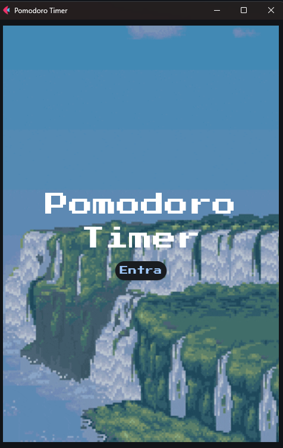

# ⏳ Pomodoro Timer 🚀  


[](https://flet.dev/)  
[](https://www.python.org/)  
[](LICENSE)  

> 🕒 Un temporizador **Pomodoro** interactivo para mejorar tu **productividad**.  
> 🎵 **Música de fondo, lista de tareas y notificaciones** para ayudarte a concentrarte.  

---

## 🚀 **Características**
✅ Temporizador Pomodoro (25 min trabajo / 5 min descanso).  
✅ 🎵 Sonidos personalizados y **control de volumen**.  
✅ 📋 **Lista de tareas** interactiva.  
✅ 🌙 **Modo oscuro** con una interfaz atractiva.  
✅ 🎨 Estilo **retro-gaming** con fuentes de Google Fonts.  

---

## 📸 **Capturas de pantalla**
### 🏠 **Pantalla de inicio**
<p align="center">
  
</p>

### ⏳ **Pantalla del temporizador**
<p align="center">
  
</p>


---

## 🔧 **Instalación y Uso**  

### 1️⃣ **Clona el repositorio**  
```sh
git clone https://github.com/usuario/pomodoro-timer.git
cd pomodoro-timer
